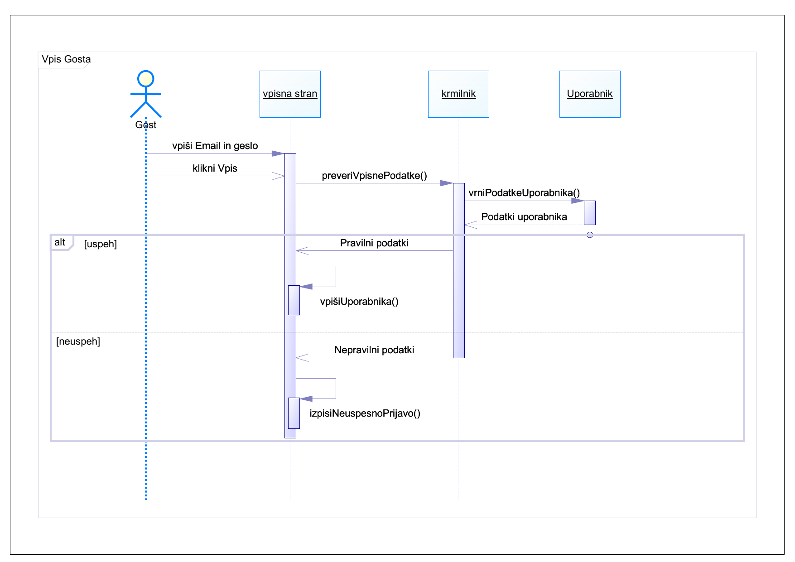
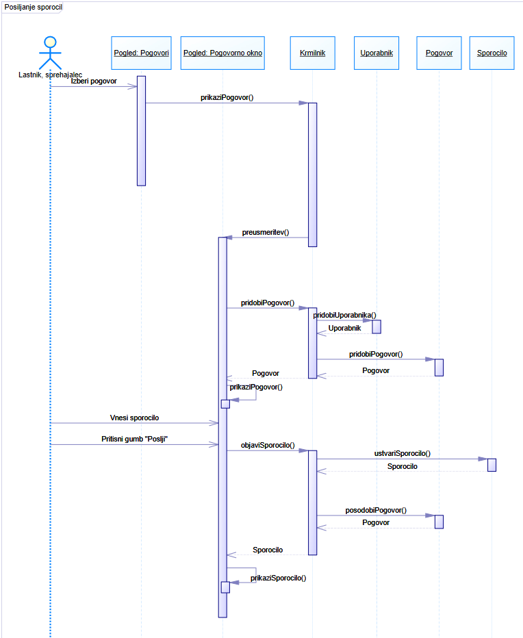
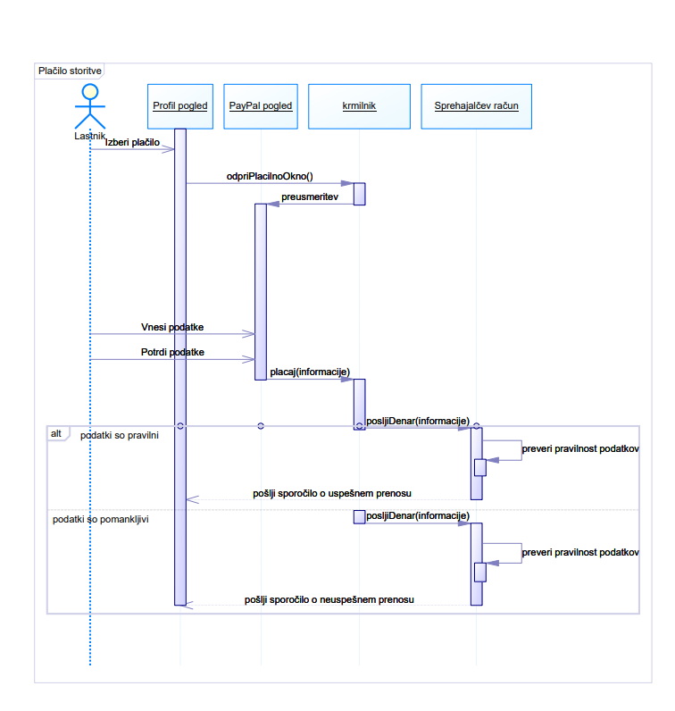

# Načrt sistema

|                             |                                                         |
| :-------------------------- | :------------------------------------------------------ |
| **Naziv projekta**          | Dog Walkers                                |
| **Člani projektne skupine** | Nejc Velikonja, Matevž Robič, Alexei Drake, Jon Selič in Sebastjan Kramar |
| **Kraj in datum**           | Slovenija, 17.4 2021                                   |

## Povzetek

V prvem razdelku sta prikazana logični an razvojni načrt arhitekture. Za logični načrt smo uporabili MVC vzorec (Model, View, Controller), v diagramu smo prikazali zahteve med posameznimi deli aplikacije. Naš razvojni načrt izdelave aplikacije implementira ustrezno dodelitev dela vsem članov. Na njem so prikazana območja odgovornosti posameznih članov. Nejc, Matevž in Alexei bodo odgovorni za dve podatkovni bazi (baza za uporabniške informacije in baza za slike in podobne medijske objekte), medtem ko bo Alexei sam sprogramiral krmilnik, Sebastjan, Jon in malo tudi Matevž bodo pa odgovorni za čelni sistem. V drugem razdelku je na sliki prikazana razredna arhitektura (diagram), katere razredi (entitete, krmilnik in robni sistemi (boundary)) so tudi s svojimi atributi in metodami vred podrobno opisani. V tretjem razdelku je prikazano obnašanje vseh 22 funkcionalnosti in njihovih morebitnih alternativnih tokov s sekvenčnimi diagrami.

## 1. Načrt arhitekture

### 1.1 Logični načrt
Logični načrt našega projekta.

Sistem smo razdelili na zaključene sklope funkcionalnosti, ki se smiselno povezujejo.
Sklopi:
- Funkcionalnosti, povezane z vpisom (Vpis, registracija, ponastavitev gesla)
- Funkcionalnosti, povezane z urejanjem profila (Urejanje profila, identifikacija, sprememba gesla, registracija psa)
- Funkcionalnosti, povezane z oglasi (Objava oglasa, odziv na oglas, opravljanje oglasov, odstranjevanje oglasa, ocenjevanje, filtriranje)
- Interakcija z drugimi uporabniki (Pošiljanje sporočil, prijava zlorabe)
- Administracija (Onemogočanje uporabniških profilov, pregled prijav, pomoč uporabnikom)
- Plačilo storitve in sledenje psu (Plačilo storitve, sledenje psu)

#### 1.1.1 Funkcionalnosti, povezane z vpisom

#### 1.1.2 Funkcionalnosti povezane z urejanjem profila

#### 1.1.3 Funkcionalnosti, povezane z oglasi

#### 1.1.4 Interakcija z drugimi uporabniki

#### 1.1.5 Administracija

#### 1.1.6 Plačilo storitve in sledenje psu

### 1.2 Razvojni načrt
Razvojni načrt za naš projekt.

## 2. Načrt strukture

### 2.1 Razredni diagram

Slika razrednega diagrama.

### 2.2 Opis razredov

🟢 Robni sistem 🔵 Entiteta 🔴 Krmilnik

#### 2.2.1 Uporabnik

🔵 Entiteta

Razred "Uporabnik" predstavlja neko stranko, bodisi lastnika ali sprehajalca, ki uporablja našo spletno aplikacijo. Obstajajo tudi drugi tipi uporabnika, kot moderatorji in administratorji.

##### Atributi

- id
- Ime (niz znakov)
- Priimek (niz znakov)
- Povprečna ocena (celo število, omejeno od 1 do 5). Lahko null
- Elektronska pošta (niz znakov, ki ustreza standardu elektronskega naslova)
- Omogočen (boolean) - pove, če je uporabnikov račun omogočen. Administrator ga lahko za kršitev pravil začasno onemogoči.
- Geslo (niz znakov)
- Slika profila (Objekt)

#### 2.2.1.1 Lastnik

🔵 Entiteta

Lastnik je tip uporabnika, ki bo objavljal oglase in s tem poskušal privabljati potencialne sprehajalce.

##### Atributi

- idPsov (tabela znakovnih nizov) - tabela enoličnih identifikatorjev psov, ki jih ima lastnik 
- idOglasov (tabela znakovnih nizov) - tabela enoličnih identifikatorjev oglasov, ki jih je lastnik objavil
- Naslov (niz znakov)

#### 2.2.1.2 Sprehajalec

🔵 Entiteta
 
Sprehajalec je tip uporabnika, ki si ogleduje oglase lasnikov in se na njih odziva.

##### Atributi

- idSprejetihOglasov (tabela znakovnih nizov) - tabela enoličnih identifikatorjev oglasov, na katere se je sprehajalec prijavil (jih sprejel)
- idPotrjenihOglasov (tabela znakovnih nizov) - tabela enoličnih identifikatorjev oglasov, katerih prijavo je ustrezen lastnik potrdil

#### 2.2.2 Pes

🔵 Entiteta

Entiteta "Pes" predstavlja enega psa, ki ga lastnik oglašuje na aplikaciji.

##### Atributi

- idLastnika (znakovni niz)
- id (znakovni niz)
- Ime (znakovni niz)
- Pasma (ena izmed ustreznih vrednosti DogAPI API-ja)
- Starost (celo število)
- Slika (Objekt)

#### 2.2.3 Oglas

🔵 Entiteta

Entiteta "Oglas" predstavlja enkratno oglaševanje enega ali več psov potencialnim sprehajalcem. Dovoljenje nad stvaritvijo oglasa ima le lastnik.

##### Atributi

- idLasntnika (znakovni niz)
- id (znakovni niz)
- idSprehajalcev (tabela znakovnih nizov) - enolični identifikatorji vseh sprehajalcev, ki so se prijavili na oglas
- idPsov (tabela znakovnih nizov) - enolični identifikatorji vseh psov, ki so povezani v oglas.
- sprejet (znakovni niz) - identifikator sprehajalce, ki je bil potrjen za sprehajanje
- aktiven (boolean) - pove, če je sprehajanje trenutno aktivno (v teku) ali ne
- opravljen (boolean) - "true", če je sprehajanje 쬰 opravljeno, "false" sicer
- kdaj (Čas (Object)) - točen čas sprehajanja. Lahko je tudi časovni razpon

#### 2.2.4 Gost

🔵 Entiteta

Poseben tip uporabnika (ni v relaciji z entiteto "Uporabnik"), ki lahko samo brska po domači strani. Drugih pravic nima

##### Atributi

- sessionId (znakovni niz) - enolični identifikator, ki ustreza enemu gostu za določen čas

#### 2.2.5 Ocena 

🔵 Entiteta

Predstavlja mnenje enega uporabnika na drugega uporabnika ali psa. Lahko je samo ocena ali pa tudi komentar

##### Atributi

- idOcenjevalca (znakovni niz)
- idPsa (znakovni niz) - enolični identifikator psa, ki je subjekt ocenjenja. Lahko je tudi null, kar pomeni da je ocenjevani Uporabnik
- idUporabnika (znakovni niz) - enolični identifikator uporabnika, ki je subjekt ocenjevanja. Lahko je tudi null, kar pomeni da je ocenjevani Pes
- ocena (celo število med 1 in 5)
- komentar (znakovni niz) - neobvezen

#### 2.2.6 Pogovor

🔵 Entiteta

Predstavlja izmenjavo sporočil med sprehajalcem in lastnikom. En par uporabnikov ima lahko kvečjemu le en pogovor. Pogovor ima točno dva sogovorca in sicer enega lastnika in enega sprehajalca.

##### Atributi

- idLastnik (znakovni niz)
- idSprehajalec (znakovni niz)
- idSporocil (tabela znakovnih nizov) - enolični identifikatorji sporočil, ki so vsebovana v pogovoru

##### Metode

- boolean posljiSporocilo(znakovni niz) - krmilniku pošlje zahtevo za dodajanje novega sporočila v podatkovno bazo. Vrne vrendost "true" če je uspešno, "false" sicer
- Sporocilo[] zahtevajSporocila(idLastnik, idSprehajalec) - krmilniku pošlje zahtevo za prikaz vseh poslanih sporočil med Lastnikom z idLastnik in Sprehajalcem z idSprehajalec. Metoda se uporabi na začetku vstopa v pogled pogovornega okna, da se prika쬰jo vsa dosedaj poslana sporočila

#### 2.2.7 Sporočilo

🔵 Entiteta

Predstavlja en znakovni niz, ki ga je v Pogovoru en uporabnik poslal drugemu ob določenem času

##### Atributi

- pogovorId (znakovni niz)
- Čas (Čas (Object)) - čas, ob katerem je bilo sporočilo shranjeno v podatkovno bazo
- posiljateljId (znakovni niz)
- vsebina (znakoni niz) - vsebina sporočila

#### 2.2.8 Prijava

🔵 Entiteta

Predstavlja prijavo nekega uporabnika administratostki ekipi zaradi morebitnega kršenja pravil

##### Atributi

- idPrijave (znakovni niz)
- idPrijavljenega (znakovni niz)
- idPrijavitelja (znakoni niz)
- Sporočilo (znakovni niz) - sporočilo prijavitelja, ki utemeljuje razlog prijave uporabnika
- Čas (Čas (Object)) - čas prijave

#### 2.2.9 Ponastavitev gesla

🟢 Robni sistem

Robni sistem "Ponastavitev gesla" predstavlja pogled, kjer gost (neprijavljen uporabnik) ponastavi geslo.

##### Nesamoumevne metode

- boolean spremeniGeslo(Object geslo): metoda, ki krmilniku pošlje zahtevo posodobitve uporabnika v Uporabniški podatkovni bazi z podanim novim geslom. Nato odjavi vse uporabnikove seje.

#### 2.2.10 Prijava Profila

🟢 Robni sistem

Robni sistem "Prijava profila" predstavlja pogled, kjer administrator pregleda prijavo in onemogoči prijavljen profil.

##### Nesamoumevne metode

- Uporabnik onemogociUporabnika(Uporabnik uporabnik): metoda, ki krmilniku pošlje zahtevo posodobitve uporabnika v Uporabniški podatkovni bazi tako, da njegov profil onemogoči.
- boolean preveriDolzino(int dolzina): metoda, ki preveri ali je bila vnesena dol쬴na onemogočenja profila.

#### 2.2.11 Obrazec prijave profila

🟢 Robni sistem

Robni sistem "Obrazec prijave profila" predstavlja pogled, kjer lahko uporabniki prijavijo nek profil, če menijo da le-ta krši pravila uporabe.

##### Nesamoumevne metode

- boolean preveriPolja(String[] vrednostiPolja): metoda, ki preveri ali so vsa polja v obrazcu za prijavo pravilno izpolnjena
- boolean posredujPrijavo(Prijava prijava): metoda, ki podatke o prijavi posreduje krmilniku, ki nato le-te shrani v podatkovno bazo

#### 2.2.12 Seznam prijav

🟢 Robni sistem

Robni sistem "Seznam prijav" predstavlja pogled, kjer se prika쬰jo vse prijave računov.

#### 2.2.13 Domača stran

🟢 Robni sistem

Robni sistem "Domača stran" predstavlja pogled, kjer so prikazani vsi oglasi.

##### Nesamoumevne metode

- void filtrirajVsebino(Object podatkiFiltra): metoda, ki prika쬰 ustrezne oglase za parametre, ki jih nastavi uporabnik
- Pogovor odzivSprehajalca(Oglas oglas, Uporabnik sprehajalec): metoda, ki jo kliče sprehajalec, ko je zainteresiran za nek oglas in 쬰li kontaktirati lastnika
- void izpisiSporociloUstrezenOdziv(): izpiše, da je bil pogovor med lastnikom in sprehajalcem ustrezno ustvarjen

#### 2.2.14 Stran za registracijo

🟢 Robni sistem

Robni sistem "Stran za registracijo" predstavlja pogled, kjer se gost lahko registrira.

##### Nesamoumevne metode

- boolean preveriVpisanePodatke(): preveri ali so vsa polja izpolnjena in ali so izpolnjena pravilno
- boolean shraniFotografijo(Slika slika): metoda, ki preko klica metode na krmilniku shrani sliko v podatkovno bazo za slike (in ne Uporabniško podatkovno bazo, ki je druga baza)

#### 2.2.15 Profil

🟢 Robni sistem

Robni sistem "Profil" predstavlja pogled, kjer si uporabnik lahko ogleda ter upravlja s podatki svojega profila.

##### Nesamoumevne metode

- Slika odpriRaziskovalca(): odpre raziskovalca datotek na računalniku, kjer lahko uporabnik izbere 쬰ljeno datoteko za nalaganje na stran
- void odpriPlacilnoOkno(): odpre okno, kjer lahko lastnik plača sprehajalcu za opravljeno delo

#### 2.2.16 Obrazec za registracijo psa

🟢 Robni sistem

Robni sistem "Obrazec za registracijo psa" predstavlja pogled, kjer lahko lastnik registrira svojega psa.

##### Nesamoumevne metode

- Slika odpriRaziskovalca(): odpre raziskovalca datotek na računalniku, kjer lahko uporabnik izbere 쬰ljeno datoteko za nalaganje na stran
- boolean registrirajPsa(Object podatkiOPsu): shrani podatke o psu v podatkovno bazo (klice metodo na krmilniku)

#### 2.2.17 Raziskovalec

🟢 Robni sistem

Robni sistem "Raziskovalec" predstavlja pogled, kjer uporabnik izbere datoteko iz svojega računalniko za nalaganje na stran.

#### 2.2.18 Sprememba gesla

🟢 Robni sistem

Robni sistem "Sprememba gesla" predstavlja pogled, kjer lahko uporabnik spremeni svoje geslo.

##### Nesamoumevne metode

- boolean spremeniGeslo(String[] vpisaniPodatki): metoda, ki posodobi geslo v podatkovni bazi (preko krmilnika)
- boolean preveriVpisaniGesli(String geslo1, String geslo2): metoda, ki preveri ali sta gesli enaki in ustrezni

#### 2.2.19 Zahteva ponastavitve gesla

🟢 Robni sistem

Robni sistem "Zahteva ponastavitve gesla" predstavlja pogled, kjer uporabnik zahteva ponastavitev gesla.

##### Nesamoumevne metode

- boolean posljiSporocilo(Object vpisaneInformacije): metoda, ki gostu poslje kodo za ponastavitev gesla, če elektronski naslov obstaja v podatkovni bazi uporabnikov.

#### 2.2.20 Odstranjevanje oglasa

🟢 Robni sistem

Robni sistem "Odstranjevanje oglasa" predstavlja pogled, kjer lahko lastnik odstrani svoj oglas, če le-ta še ni bil sprejet.

##### Nesamoumevne metode

- boolean odstraniOglas(Oglas oglas): metoda, ki odstrani oglas iz podatkovne baze, če ta oglas še ni bil sprejet (preko krmilnika)

#### 2.2.21 Vpisna stran

🟢 Robni sistem

Robni sistem "Vpisna stran" predstavlja pogled, kjer se gost vpiše v sistem.

##### Nesamoumevne metode

- boolean preveriVpisanePodatke(String[] vpisaniPodatki): preveri če je uporabnik v podatkovni bazi za Uporabnike in če so podatki ustrezni
- void vpisiUporabnika(Uporabnik uporabnik): gosta vpiše v sistem

#### 2.2.22 Opravljanje oglasa

🟢 Robni sistem

Robni sistem "Opravljanje oglasa" predstavlja pogled, kjer lastnik potrdi, da je sprehajalec dokončal svoje delo.

##### Nesamoumevne metode

- boolean opraviOglas(Oglas oglas): metoda, ki oglas v podatkovni bazo označi kot opravljenega.
- void preusmeri(): metoda, ki lastnika preusmeri na ocenjevanje sprehajalca

#### 2.2.23 Oceni

🟢 Robni sistem

Robni sistem "Oceni" predstavlja pogled, kjer sprehajalec oceni lastnikove pse.

##### Nesamoumevne metode

- Ocena posredujOceneKomentarje(Object vpisaneInformacije): metoda, ki v podatkovno bazo shrani ocene in komentarje za pse ali druge uporabnike.

#### 2.2.24 Paypal

🟢 Robni sistem

Robni sistem "Paypal" predstavlja pogled, kjer lastnik lahko plača sprehajalcu za opravljeno delo.

##### Nesamoumevne metode

- void placaj(Object informacije): metoda, ki krmilniku pošlje podatke za plačilo

#### 2.2.25 NodeMailer

🟢 Robni sistem

Robni sistem "NodeMailer" je zunanji API za pošiljanje elektronskih sporočil.

#### 2.2.26 Pomoč uporabnikom

🟢 Robni sistem

Robni sistem "Pomoč uporabnikom" predstavlja pogled, kjer lahko uporabnik/gost pošlje sporočilo skrbnikom sistema in prosi za pomoč.

##### Nesamoumevne metode

- boolean preveriPolja(): preveri ali so vsa polja ustrezno izpolnjena
- boolean posljiSporocilo(): pošlje sporočilo skrbnikom

#### 2.2.27 Oglas v teku

🟢 Robni sistem

Robni sistem "Oglas v teku" predstavlja pogled, kjer lastnik vpiše kodo ovratnice na psu in tako sledi lokaciji psa.

##### Nesamoumevne metode

- void sinhroniziraj(String koda): sinhronizira vnešeno kodo ovratnice z aplikacijo (kliče metodo na krmilniku)
- Lokacija zacniSejo(String koda): začne sejo z vpisano kodo in prejema sporocila o lokaciji

#### 2.2.28 Pogovorno okno

🟢 Robni sistem

Robni sistem "Pogovorno okno" predstavlja pogled, kjer se sprehajalec lahko pogovarja z lastnikom.

##### Nesamoumevne metode

- Sporocilo objaviSporocilo(Sporocilo sporocilo): metoda, ki (preko krmilnika) doda sporocilo pogovoru

#### 2.2.29 Objava oglasa

🟢 Robni sistem

Robni sistem "Objava oglasa" predstavlja pogled, kjer lastnik lahko objavi nov oglas.

##### Nesamoumevne metode

- boolean imaPse(Uporabnik lastnik): preveri ali ima uporabnik pse.
- Oglas kreirajOglas(String[] vneseniPodatki): ustvari nov oglas z vpisanimi podatki

#### 2.2.30 Pogovori

🟢 Robni sistem

Robni sistem "Pogovori" predstavlja pogled, kjer uporabnik vidi vse svoje pogovore.

#### 2.2.31 Dog API

🟢 Robni sistem

Robni sistem "Dog API" je zunanji API, ki nam da podatke o različnih pasmah psov.

#### 2.2.32 Pogled oglas

🟢 Robni sistem

Robni sistem "Pogled oglas" predstavlja pogled, kjer lastnik lahko upravlja s svojimi oglasi.

#### 2.2.33 Urejanje profila

🟢 Robni sistem

Robni sistem "Urejanje profila" predstavlja pogled, kjer lahko uporabnik ureja podatke svojega profila.

##### Nesamoumevne metode

- Uporabnik posodobiProfil(Object vneseniPodatki): pošlje vpisane podatke v krmilnik, ki nato posodobi uporabnika v podatkovni bazi
- boolean preveriVnos(Object vneseniPodatki): preveri ali so vnešeni podatki ustrezni

#### 2.2.34 Krmilnik

🔴 Krmilnik

Univerzalni krmilnik za vse "frontend" poglede. Komunicira z dvema podatkovnima bazama

##### Metode

Metode, ki vračajo podatkoni tip "boolean", bodo vrnile "true", če je metoda uspela, in "false" sicer

- boolean shraniForografijo (Object fotografija) - metoda, ki preko klica na krmilniku shrani sliko v podatkovno bazo za slike (in ne v podatkovno bazo za uporabnike, ki je druga podatkovna baza) 
- Prijave[] pridobiPrijave() - izvršena, ko administrator navigira na zavihek s prijavami
- Uporabnik onemogociUporabnika (id_uporabnika) - administrator onemogoči profil danega uporabnika
- Oglasi[] pridobiOglase() - izvršena, ko katerikoli uporabnik navigira na domačo stran, kjer se mu prika쬰jo vsi aktivni oglasi
- Oglas pridobiOglas(idOglasa) - pridobi informaije o nekem oglasu, ki ga prika쬰 v master-detail vzorcu
- Oglas odstraniOglas(iOglasa)
- Oglas posodobiOglas(idOglasa, Objekt informacije)
- Uporabnik pridobiUporabnika()
- Pse[] pridobiPse()
- Pes pridobiPsa(idPsa)
- Pogovori[] pridobiPogovore()
- Pogovor pridobiPogovor(idPogovora)
- Pogovor posodobiPogovor(idPogovora, Object informacije)
- Pogovor ustvariPogovor(idLastnika, idSprehajalca)
- Sporocilo posljiSporocilo(idPogovora, Object informacije) - shrani sporočilo Pogovoru z idPogovora
- void odpriPlacilnoOkno()
- boolean placaj(Object informacije) - krmilnik pošlje zahtevo zunanjemu sistemu za izvršitev plačila
- boolean sinhroniziraj(String koda) - uporabljena za sinhronizacijo elektronske ovratnice z aplikacijo
- boolean zacniSejo() - prične sejo pridobivanja lokacijskih podatkov od elektronske ovratnice
- boolean preveriVpisnePodatke(String vpisni podatki) - preveri pravilnost vpisnih podatkov. 
- Pes registrirajPsa(Object informacije) - z informacijami ki so podane skuša ustvariti novo entiteto Pes
- Ocena posredujOcenaKomentar(Object informacije) - skuša ustvariti novo oceno
- Prijava posredujPrijavo (Object informacije)
- Oglas ustvariOglas(Object informacije)
- void preusmeritev() - preusmeritev pogleda na drug pogled
- boolean spremeniGeslo(Object informacije)
- boolean kodaVnesena() - potrdi pravilnost kode, ki je bila poslana na elektronski naslov ob ponastavitvi gesla.
- void generirajKodo() - krmilnik pošlje zahtevo elektronski ovratnici DogEye, ki generira unikatno kodo na zaslonu ovratnice
- Object zahtevajLokacijo() - krmilnik pošlje zahtevo za trenutne GPS koordinate od elektronske ovratnice DogEye
- Uporabnik posodobiProfil(Object vneseniPodatki): krmilnik posodobi uporabnika v podatkovni bazi z novimi podatki

## 3. Načrt obnašanja

### 3.1 Vpis gosta

### 3.2 Registracija gosta

#### 3.2.1 Osnovni tok

#### 3.2.1 Alternativni tok - napacen vnos

### 3.3 Registracija psa

### 3.4 Opravljanje oglasov

### 3.5 Odstranjevanje oglasov

### 3.6 Ocenjevanje lastnikov

### 3.7 Ocenjevanje sprehajalcev

### 3.8 Prijava zlorabe

### 3.9 Onemogočanje profila

### 3.10 Objava oglasa

### 3.11 Odziv na oglas

### 3.12 Pošiljanje sporočil

### 3.13 Placilo storitve

### 3.14 Sledenje psa

### 3.15 Dodajanje slike

### 3.16 Pregled prijav

### 3.17 Urejanje profila

#### 3.17.1 Osnovni tok

#### 3.17.2 Alternativni tok - Napacen vnos

### 3.18 Sprememba gesla

#### 3.18.1 Osnovni tok

#### 3.18.2 Alternativni tok

### 3.19 Ponastavitev gesla

#### 3.19.1 Osnovni tok

#### 3.19.2 Alternativni tok - Napacen elektronski naslov

#### 3.19.3 Alternativni tok - Napacna referenca

### 3.20 Filtriranje vsebine

### 3.21 Pomoč uporabnikom

#### 3.21.1 Osnovni tok

#### 3.21.2 Alternativni tok - Napačen vnos

