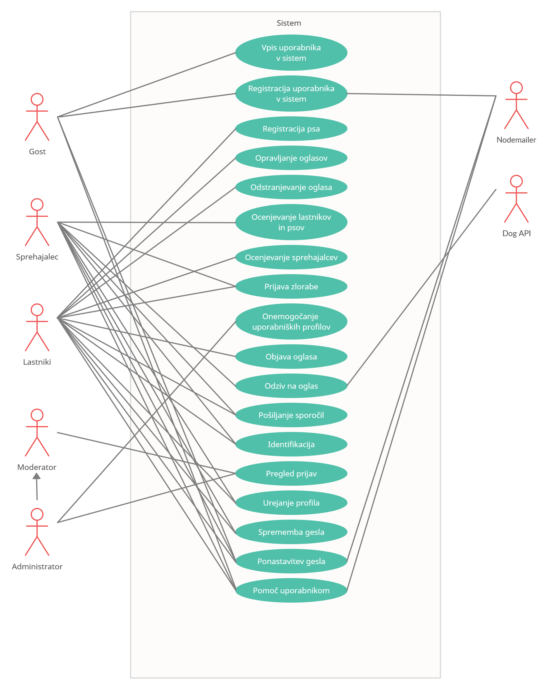
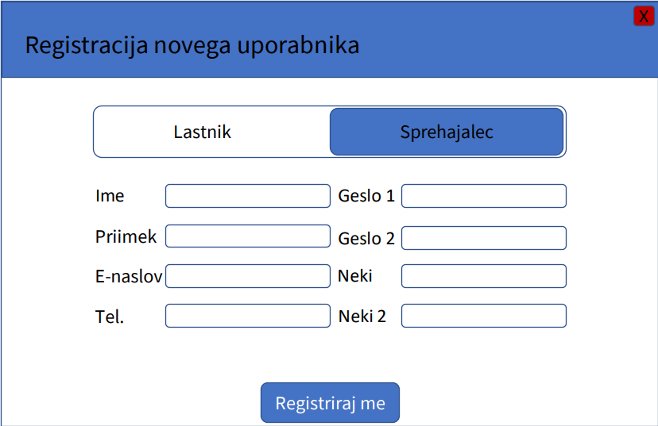
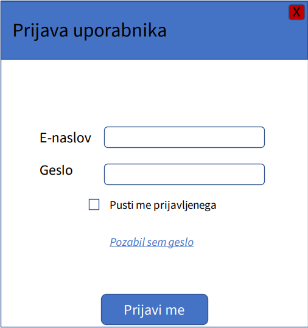
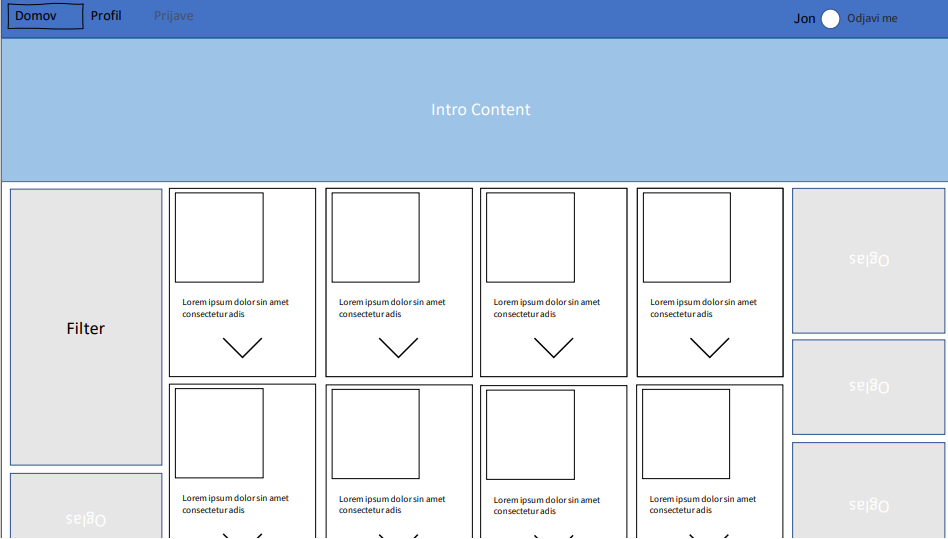
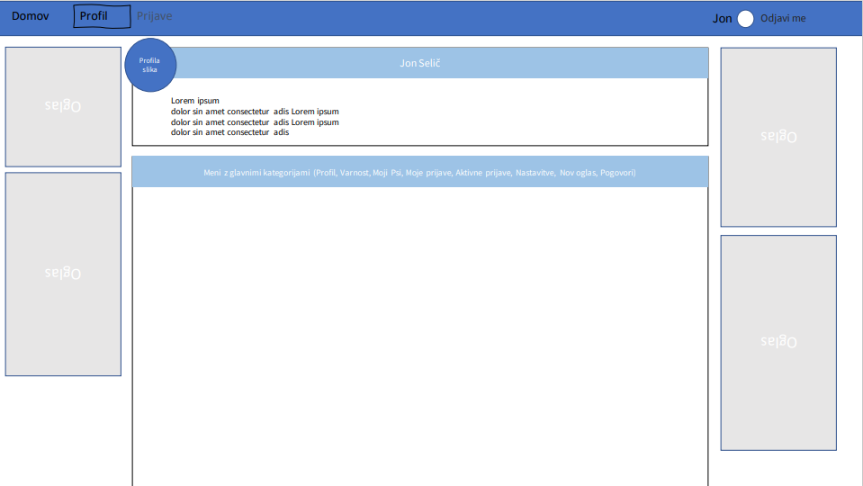
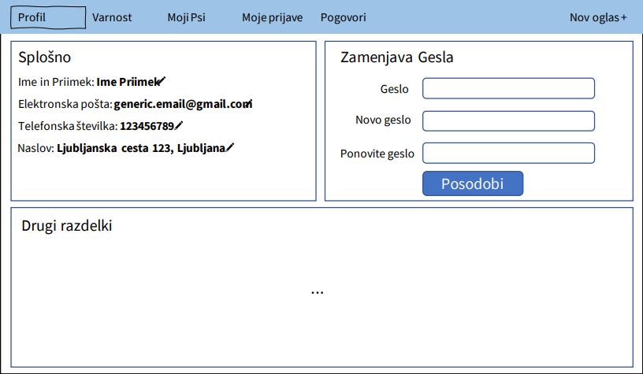
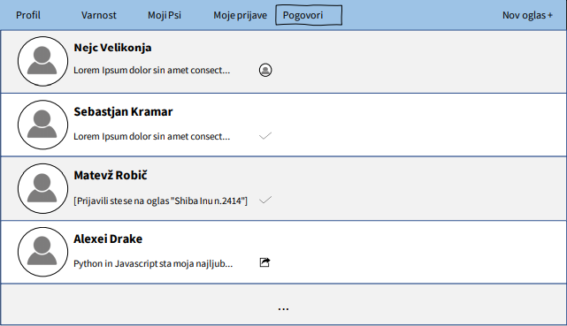
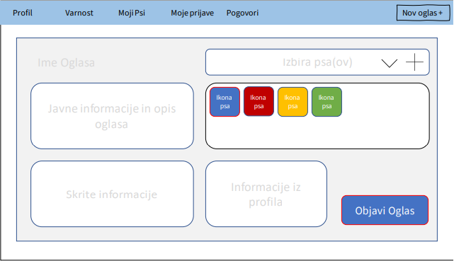
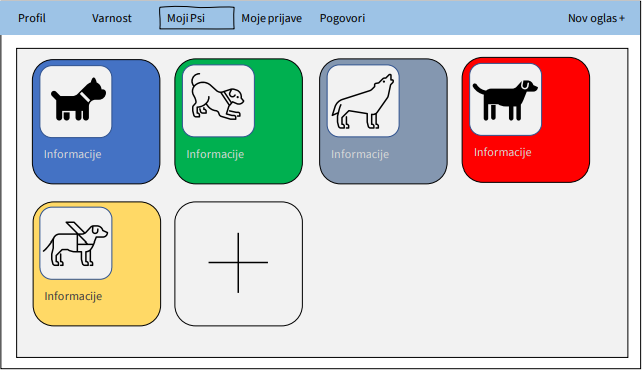
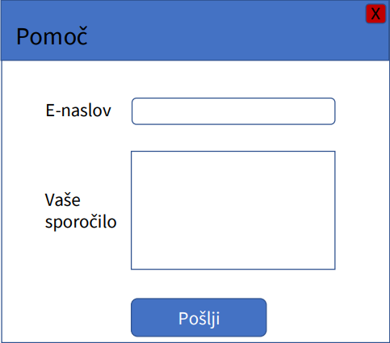

# Dokument zahtev

|                             |                                                                         |
| :-------------------------- | :---------------------------------------------------------------------- |
| **Naziv projekta**          | Dog Walkers                                                             |
| **Člani projektne skupine** | Alexei Drake, Jon Selič, Matevž Robič, Nejc Velikonja, Sebastjan Kramar |
| **Kraj in datum**           | Ljubljana, 1. april 2021                                                |

## Povzetek projekta

Aplikacija Dog Walkers je naš pristop do rešitve problema varstva in sprehajanja človekovega najboljšega prijatelja. Spletna stran bo ljudem, ki si želijo preživljati čas s kosmatinci a nimajo denarja za ves čas se ukvarjati z njim, na preprost in intuitiven način omogočala povezavo z ljudmi, ki jim pa manjka čas peljati psa vsak dan na sprehod.

## 1. Uvod

Marsikateri lastnik psa (v nadaljevanju **Lastnik**) zaradi različnih obveznosti nima časa peljati svojega psa vsak dan na sprehod. Nemalokrat se zgodi, da gredo lastniki psa na počitnice/izlet, ljubljenčka pa nimajo kje pustiti. Nasprotno pa obstajajo ljudje, ki imajo radi pse in bi jih radi občasno sprehajali (v nadaljevanju **Sprehajalci**), vendar si psa ne lastijo. Zato smo se odločili razviti spletno aplikacijo **DogWalkers**, ki deluje kot posrednik med Sprehajalci in Lastniki! Lastnikom omogoča, da objavijo oglas, kjer navedejo, v katerem časovnem obdobju bi potrebovali varstvo za svojega psa. V kolikor sprehajalcu naveden termin ustreza in bi ga radi sprehajali/čuvali (odvisno od časovnega obdobja), se lahko na oglas odzove ter se z Lastnikom s privatnimi sporočili dogovori o podrobnostih. Aplikacija omogoča medsebojno ocenjevanje Lastnikov in Sprehajalcev ter prijavo domnevne zlorabe psa ali drugega nedostojnega obnašanja. Tak sistem skrbi za "izločevanje" neprimernih oseb iz **DogWalkers** skupnosti in skuša ustvariti varno okolje za naše male cucke.

## 2. Uporabniške vloge

V tem poglavju so predstavljene uporabniške vloge.

**Lastnik** je prijavljen uporabnik, ki je pri registraciji izbral to vlogo. Lahko filtrira oglase. Lastnik lahko objavi oglas. Ima možnost registracije svojega psa kot podprofil, za katerega lahko objavi oglas za sprehajanje. Ima dostop do zasebnega tekstovnega pogovora s sprehajalci, ki so se odzvali na njegov oglas. Po opravljenih sprehajanjih lahko oceni ali prijavi sprehajalca. Lahko ureja svoj profil in si spremeni geslo. Skozi funkcionalnost "Pomoč uporabnikom" lahko kontaktira moderatorsko ekipo.

**Sprehajalec** je prijavljen uporabnik, ki je pri registraciji izbral to vlogo. Lahko filtrira oglase. Sprehajalec se lahko odzove na oglas. Ima dostop do zasebnega pogovora z tistimi lastniki, katerim se je odzval na oglas. Lahko oceni ali prijavi lastnike in njihove pse. Lahko ureja svoj profil in si spremeni geslo. Skozi funkcionalnost "Pomoč uporabnikom" lahko kontaktira moderatorsko ekipo.

**Gost** je neprijavljen uporabnik. Lahko filtrira oglase. Lahko se registrira ali prijavi. Lahko zahteva ponastavitev gesla. Skozi funkcionalnost "Pomoč uporabnikom" lahko kontaktira moderatorsko ekipo.

**Moderator** je prijavljen uporabnik s posebnimi pravicami. Lahko filtrira oglase. Lahko odstranjuje oglase. Lahko prijavi zlorabo in si ogleda vse prijave profilov. Lahko ureja svoj profil in si spremeni geslo. Skozi funkcionalnost "Pomoč uporabnikom" lahko kontaktira moderatorsko ekipo.

**Administrator** je prijavljen uporabnik s posebnimi pravicami. Lahko odstrani ali zacasno onemogoci katerikoli profil. Lahko počne tudi vse kar lahko počnejo drugi računi, vključno z moderatorji.

## 3. Slovar pojmov

V tem razdelku so predstavljene besede, ki so v zajemu zahtev uporabljene, in njihovi pomeni.

- **Geslo**: niz sestavljen iz številk, malih in velikih črk
- **Neustrezno geslo**: prešibko geslo, ali geslo, ki vsebuje nedovoljene znake.
- **Raziskovalec datotek**: okno za izbiro datotek, ki jih uporabnik želi prenesti na spletno stran
- **Registracija**: ustvaritev novega uporabniškega računa na spletni strani.
- **Vpis**: vpis v sistem z uporabniškim računom.
- **Registracija psa**: ustvari profil za psa, kar lastniku omogoči objavljanje oglasov
- **Profil**: prikaz podatkov o željenem uporabniku ali psu skupaj s sliko
- **Oglas**: vsebuje podatke o psu in potrebah lastnika
- **Sprejet oglas**: oglas, ki ga je sprehajalec že sprejel
- **Ocena**: ocena kvalitete s 5 stopnjami od nezadostno do odlično
- **Prijava profila**: omogoča prijavo profila, če uporabnik krši pogoje uporabe
- **Onemogočen profil**: v onemogočen profil se uporabnik ne more več prijaviti, vsi njegovi oglasi se zbrišejo in njegov email naslov ne more biti uporabljen za registracijo drugega računa
- **Direktno sporočilo**: sporočilo, ki ga vidita samo lastnik in sprehajalec
- **PayPal**: zunanja funkcionalnost za lažje plačilo med uporabniki
- **Elektronska ovratnica DogEye**: ovratnica z vgrjenim GPS sledilnikom, ki lastnikom omogoča sledenje oziroma prikaz pozicije njihovega psa na zemljevidu
- **GDPR**: evropski zakon o varstvu osebnih podatkov
- **SCRUM**: način razvijanja produktov
- **Moderatorska ekipa**: ekipa moderatorjev in administratorjev, ki upravljajo spletno stran in skrbijo za pravilno delovanje.
- **Stranka**: oseba, ki uporablja našo spletno stran

## 4. Diagram primerov uporabe

Diagram primerov uporabe za naši aplikacijo.

  

## 5. Funkcionalne zahteve

V tem poglavju so predstavljene funkcionalne zahteve naše aplikacije. Vsaki zahtevi je dodan povzetek, osnovi tok, alternativni tokovi, pogoji, posledice, posebnosti in sprejemni testi.

🟢 Must Have
🟡 Should Have
🟠 Could Have
🔴 Would Have

### 5.1 Vpis uporabnika v sistem
🟢 Must Have
#### Povzetek funkcionalnosti
**Gostje** se lahko vpišejo v sistem, kar jim omogoča dostop do bolj kompleksnih funkcionalnosti.
#### Osnovni tok
1. **Gost** na vpisni strani vnese veljaven elektronski naslov in geslo.
2. **Gost** pritisne gumb za vpis.
3. **Gost** je vpisan in pridobi dovoljenja **sprehajalca**, **lastnika**, **moderatorja** ali **administratorja**.
4. **Gost** je preusmerjen na stran profila.
#### Alternativni tok 1
1. **Gost** na vpisni strani vpiše neveljaven elektronski naslov ali geslo.
2. **Gost** pritisne gumb za vpis.
3. **Gostu** se prikaže sporočilo: "Podatki so nepravilni".
#### Alternativni tok 2
1. **Gost** na vpisni strani ne vpiše elektronskega naslova ali gesla.
2. **Gost** pritisne gumb za vpis.
3. **Gostu** se prikaže sporočilo: "Podatki so nepopolni".
#### Pogoji
- **Gost** ne sme biti vpisan v sistem.
- **Gost** mora biti registriran v sistemu, torej ima registrirano uporabniško ime in geslo.
#### Posledice
- **Gost** pridobi dovoljenja ustreznega uporabniškega tipa in je vpisan v sistem.
#### Sprejemni testi
1. Testira se uspešen vpis **gosta** v sistem.
    - Začetno stanje: **Gost** je na vpisni strani.
    - Vhod: **Gost** vpiše veljavno uporabniško ime in geslo. **Gost** pritisne na gumb za vpis.
    - Pričakovan rezultat: **Gost** pridobi uporabniška dovoljenja.
2. Testira se neuspešen vpis **gosta** v sistem.
    - Začetno stanje: **Gost** je na vpsini strani.
    - Vhod: **Gost** vpiše neveljavno uporabniško ime in geslo. **Gost** pritisne na gumb za vpis.
    - Pričakovan rezultat: **Gost** ne pridobi uporabniškega dovoljenja.
3. Testira se nepopoln vpis **gosta** v sistem.
    - Začetno stanje: **Gost** je na vpisni strani.
    - Vhod: **Gost** vpiše le uporabniško ime ali le geslo. **Gost** pritisne na gumb za vpis.
    - Pričakovan rezultat: **Gost** ne pridobi uporabniškega dovoljenja.

### 5.2 Registracija uporabnika v sistem
🟢 Must Have
#### Povzetek funkcionalnosti
- **Gostje** se lahko registrirajo v sistem. Tako pridobijo uporabniška dovoljenja za vlogo bodisi **lastnika** ali **sprehajalca**.
#### Osnovni tok
1. **Gost** na registracijski strani vnese vsa potrebna polja.
2. **Gost** pritisne gumb za registracijo.
3. **Gost** je registriran in vpisan.
4. **Gost** je preusmerjen na profilno stran.
#### Alternativni tok 1
1. **Gost** na registracijski strani vnese neveljaven elektronski naslov ali geslo.
2. **Gost** pritisne gumb za prijavo.
3. **Gostu** se prikaže sporočilo: "Podatki so nepravilni".
#### Alternativni tok 2
1. **Gost** na registracijski strani izpusti eno ali več zahtevanih vnosnih polj.
2. **Gost** pritisne gumb za prijavo.
3. **Gostu** se prikaže sporočilo: "Podatki so nepopolni".
#### Alternativni tok 3
1. **Gost** na registracijski strani vnese elektronski naslov že registriranega uporabnika.
2. **Gost** pritisne gumb za prijavo.
3. **Gostu** se prikaže sporočilo: "Uporabnik je že registririan".
#### Pogoji
- **Gost** ne sme biti prijavljen v sistem.
- **Gost** mora imeti vsaj en elektronski naslov, ki še ni bil registriran.
#### Posledice
- **Gost** pridobi dovoljenja ustreznega uporabniškega tipa in je registriran ter prijavljen v sistem.
#### Sprejemni testi
1. Testira se uspešno registracijo **gosta** v sistem.
    - Začetno stanje: **Gost** je na registracijski strani.
    - Vhod: **Gost** vnese veljavne podatke. **Gost** pritisne na gumb za registracijo.
    - Pričakovan rezultat: **Gost** je registriran in pridobi uporabniška dovoljenja.
2. Testira se neuspešno registracijo **gosta** v sistem.
    - Začetno stanje: **Gost** je na prijavni strani.
    - Vhod: **Gost** vpiše neveljaven elektronski naslov ali geslo. **Gost** pritisne na gumb za registracijo.
    - Pričakovan rezultat: **Gost** ni registriran in ne pridobi uporabniškega dovoljenja.
3. Testira se nepopolno registracijo **gosta** v sistem.
    - Začetno stanje: **Gost** je na prijavni strani.
    - Vhod: **Gost** izpusti eno ali več zahtevanih vnosnih polj. **Gost** pritisne na gumb za registracijo.
    - Pričakovan rezultat: **Gost** ni registriran in ne pridobi uporabniškega dovoljenja.
4. Testira se ponovno registracijo **gosta** v sistem.
    - Začetno stanje: **Gost** je na prijavni strani. V sistemu obstaja vsaj en registriran uporabnik.
    - Vhod: **Gost** vnese elektronski naslov že registriranega uporabnika in vse ostale potrebne podatke. **Gost** pritisne na gumb za registracijo.
    - Pričakovan rezultat: **Gost** ni registriran in ne pridobi uporabniškega dovoljenja.

### 5.3 Registracija psa
🟢 Must Have
#### Povzetek funkcionalnosti
**Lastniki** lahko znotraj svojega profila prijavijo tudi svoje pse, ki dobijo svoj podprofil vezan na njihovega **lastnike**.
Za razliko od **lastnika**, mora imeti pes na njegovem profilu vse potrebne podatke, vključno s sliko.
#### Osnovni tok
1. **Lastnik** se nahaja na strani profila.
2. **Lastnik** izbere funkcionalnost "Dodaj psa".
3. **Lastnik** je preusmerjen na obrazec za vpis podatkov o psu.
4. **Lastnik** vpiše podatke o psu.
5. **Lastnik** izbere funkcionalnost "Dodaj sliko". Pojavi se raziskovalec datotek.
6. **Lastnik** izbere željeno sliko. Raziskovalec datotek se zapre.
7. **Lastnik** pritisne gumb "Naloži".
8. Sistem prikaže sporočilo: "Pes je registriran".
#### Alternativni tok 1
1. **Lastnik** se nahaja na strani profila.
2. **Lastnik** izbere funkcionalnost "Dodaj psa".
3. **Lastnik** je preusmerjen na obrazec za vpis podatkov o psu.
4. **Lastnik** ne vpiše vseh podatkov o psu.
5. **Lastnik** izbere funkcionalnost "Dodaj sliko". Pojavi se raziskovalec datotek.
6. **Lastnik** izbere željeno sliko. Raziskovalec datotek se zapre.
7. **Lastnik** pritisne gumb "Naloži".
8. Sistem prikaže sporočilo: "Podatki nepopolni".
#### Alternativni tok 2
1. **Lastnik** se nahaja na strani profila.
2. **Lastnik** izbere funkcionalnost "Dodaj psa".
3. **Lastnik** je preusmerjen na obrazec za vpis podatkov o psu.
4. **Lastnik** ne vpiše vseh podatkov o psu.
5. **Lastnik** pritisne gumb "Dodaj sliko". Pojavi se raziskovalec datotek.
6. **Lastnik** izbere datoteko, ki ni slika. Raziskovalec datotek se zapre.
7. **Lastnik** izbere funkcionalnost "Naloži".
8. Sistem prikaže sporočilo: "Neveljavna datoteka".
#### Pogoji
/
#### Posledice
- Pes je registriran v sistemu.
- **Lastnik** dobi na svoji profilni strani povezavo do novoustvarjenega profila psa.
#### Sprejemni testi
1. Testira se uspešno registracijo psa.
    - Začetno stanje: **Lastnik** je na strani profila. Vsa polja so neizpolnjena.
    - Vhod: **Lastnik** vnese veljavne podatke o psu. **Lastnik** doda sliko. **Lastnik** pritisne na gumb za registracijo.
    - Pričakovan rezultat: Pes je registriran pod **lastnikovim** uporabniškim profilom. **Lastnik** dobi na svoji profilni strani povezavo do novoustvarjenega profila psa.
2. Testira se uspešno registracijo psa.
    - Začetno stanje: **Lastnik** je na strani profila. Vsa polja so neizpolnjena.
    - Vhod: **Lastnik** vnese veljavne podatke o psu. **Lastnik** ne doda slike. **Lastnik** pritisne na gumb za registracijo.
    - Pričakovan rezultat: Pes ni registriran pod **lastnikov** uporabniški profil in prikaže se sporočilo "Podatki nepopolni".
3. Testira se nepopolno registracijo psa.
    - Začetno stanje: **Lastnik** je na strani profila. Vsa polja so neizpolnjena.
    - Vhod: **Lastnik** ne doda slike. **Lastnik** pritisne na gumb za registracijo.
    - Pričakovan rezultat: Pes ni registriran pod **lastnikov** uporabniški profil in prikaže se sporočilo "Podatki nepopolni".
4. Testira se nepopolno registracijo psa.
    - Začetno stanje: **Lastnik** je na strani profila. Vsa polja so neizpolnjena.
    - Vhod: **Lastnik** pritisne na gumb za registracijo.
    - Pričakovan rezultat: Pes ni registriran pod **lastnikov** uporabniški profil in prikaže se sporočilo "Podatki nepopolni".
5. Testira se nepravilno izbiro slike ob registracije psa.
    - Začetno stanje: **Lastnik** je na strani profila. Vsa polja so neizpolnjena.
    - Vhod: **Lastnik** izpolni zahtevana vnosna polja o psu. **Lastnik** izbere datoteko, ki ni slika. **Lastnik** pritisne na gumb za registracijo.
    - Pričakovan rezultat: Pes ni registriran pod **lastnikov** uporabniški profil in prikaže se sporočilo "Neveljavna datoteka".

### 5.4 Opravljanje oglasov
🟢 Must Have
#### Povzetek funkcionalnosti
**Lastnik** lahko označi oglas kot opravljen.
#### Osnovni tok
1. **Lastnik** izbere funckionalnost upravljanja z oglasi.
2. **Lastnik** izbere oglas.
3. **Lastnik** pritisne gumb "Opravljeno".
4. Sistem označi oglas kot opravljen.
#### Alternativni tok 1
1. **Lastnik** izbere funckionalnost upravljanja z oglasi.
2. **Lastnik** izbere oglas, ki še ni bil sprejet.
3. **Lastnik** pritisne gumb "Opravljeno".
4. Sistem izpiše sporočilo: "Oglas še ni sprejet".
#### Pogoji
- **Lastnik** mora imeti objavljen oglas, ki ga je že sprejel nek **sprehajalec**.
#### Posledice
- Oglas je označen kot opravljen, in ni več prikazan na seznamu aktivnih sprehajanj.
#### Sprejemni testi
1. Testira se označevanje sprejetega oglasa kot opravljenega.
   - Začetno stanje: **Lastnik** je na strani profila, v razdelku upravljanja z oglas.
   - Vhod: **Lastnik** izbere že sprejeti oglas. **Lastnik** pritisne gumb "Opravljeno".
   - Pričakovan rezultat: Oglas je označen kot opravljen
2. Testira se označevanje ne sprejetega oglasa kot opravljenega.
   - Začetno stanje: **Lastnik** je na strani profila, v razdelku upravljanja z oglas.
   - Vhod: **Lastnik** izbere ne sprejeti oglas. **Lastnik** pritisne gumb "Opravljeno".
   - Pričakovan rezultat: Sistem izpiše sporočilo "Oglas še ni sprejet", oglas ostane ne spremenjen.

### 5.5 Odstranjevanje oglasa
🟢 Must Have
#### Povzetek funkcionalnosti
**Lastnik** lahko predčasno odstrani oglas.
#### Osnovni tok
1. **Lastnik** izbere funckionalnost upravljanja z oglasi.
2. **Lastnik** izbere oglas.
3. **Lastnik** pritisne gumb "Odstrani oglas".
4. Sistem prikaže sporočilo "Oglas odstranjen"
#### Alternativni tok 1
1. **Lastnik** izbere funckionalnost upravljanja z oglasi.
2. **Lastnik** izbere sprejeti oglas.
3. **Lastnik** pritisne gumb "Odstrani oglas".
4. Sistem prikaže sporočilo "Sprejetega oglasa ni več mogoče odstraniti. Lahko ga označite kot opravljenega.".
#### Pogoji
- **Lastnik** mora imeti objavljen oglas, ki ga še ni sprejel noben **sprehajalec**.
#### Posledice
- Oglas ni več viden na zavihku oglasi
#### Sprejemni testi
1. Testira se uspešno odstranjevanje oglasa.
   - Začetno stanje: **Lastnik** je na strani profila, v razdelku upravljanja z oglas.
   - Vhod: **Lastnik** izbere ne sprejeti oglas. **Lastnik** pritisne gumb "Odstrani oglas".
   - Pričakovan rezultat: Oglas je deaktiviran ter sistem prikaže sporočilo "Oglas odstranjen".
2. Testira se ne uspešno odstranjevanje sprejetega oglasa.
   - Začetno stanje: **Lastnik** je na strani profila, v razdelku upravljanja z oglas.
   - Vhod: **Lastnik** izbere ne sprejeti oglas. **Lastnik** pritisne gumb "Odstrani oglas".
   - Pričakovan rezultat: Sistem prikaže sporočilo "Sprejetega oglasa ni več mogoče odstraniti. Lahko ga označite kot opravljenega.".

### 5.6 Ocenjevanje lastnikov in psov
🟡 Should Have
#### Povzetek funkcionalnosti
**Sprehajalci** lahko ocenijo in komentirajo **lastnike** in njihove pse, katerih oglase so opravljali.
#### Osnovni tok
1. **Sprehajalec** izbere funkcionalnost ocenjevanje opravljenega oglasa.
2. Prikažejo se mu polja za **lastnika** in vse pse, ki so bili navedeni v oglasu.
3. **Sprehajalec** izbere ustrezno oceno lastnika, opcijske ocene psov v oglasu in doda opcijske komentarje.
4. **Sprehajalec** pritisne gumb "Objavi".
5. Sistem prikaže sporočilo: "Ocena uspešno oddana"
#### Alternativni tok 1
1. **Sprehajalec** izbere funkcionalnost ocenjevanje opravljenega oglasa.
2. Prikažejo se mu polja za **lastnika** in vse pse ki so bili navedeni v oglasu.
3. **Sprehajalec** ne izbere ocene lastnika.
4. **Sprehajalec** pritisne gumb "Objavi".
5. Sistem prikaže sporočilo napake: "Ocena mora biti podana"
#### Pogoji
- **Sprehajalec** se je odzval na oglas **lastnika**.
- **Lastnik** je potrdil odziv sprehajalca.
- **Lastnik** je označil oglas kot opravljen.
#### Posledice
- Komentar lastnika je prikazan na **lastnikovem** opravljenem delu.
- Morebitni komentarji psov so prikazani na profilih psov.
#### Sprejemni testi
1. Testira se uspešno oceno lastnika
   - Začetno stanje: **Lastnik** je označil oglas kot opravljen. **Sprehajalec** je na strani opravljenega oglasa. Vsa polja so neizpolnjena.
   - Vhod: **Sprehajalec** izbere ustrezno oceno lastnika, opcijsko ocene psov v oglasu in opcijsko doda komentarje. **Sprehajalec** pritisne gumb "Objavi".
   - Pričakovan rezultat: Sistem prikaže sporočilo napake: "Ocena uspešno oddana". Komentar lastnika je prikazan na **lastnikovem** opravljenem delu. Morebitni komentarji psov so prikazani na profilih psov.
2. Testira se neuspešno oceno lastnika ter psa
   - Začetno stanje: **Lastnik** je označil oglas kot opravljen. **Sprehajalec** je na strani opravljenega oglasa. Vsa polja so neizpolnjena.
   - Vhod: **Sprehajalec** ne izbere ustrezne ocene lastnika, opcijsko oceni pse v oglasu in opcijsko doda komentarje. **Sprehajalec** pritisne gumb "Objavi".
   - Pričakovan rezultat: Sistem prikaže sporočilo napake: "Ocena mora biti podana".

### 5.7 Ocenjevanje sprehajalcev
🟡 Should Have
#### Povzetek funkcionalnosti
**Lastniki** lahko ocenijo in komentirajo **sprehajalce**, ki so opravljali njihove oglase.
#### Osnovni tok
1. **Lastnik** izbere funkcionalnost ocenjevanja opravljenega dela.
2. **Lastnik** izbere ustrezno oceno in opcijsko doda komentar.
3. **Lastnik** pritisne gumb "Objavi".
4. Sistem prikaže sporočilo: "Ocena uspešno oddana"
#### Alternativni tok 1
1. **Lastnik** izbere funkcionalnost ocenjevanja opravljenega oglasa.
2. **Lastnik** ne izbere ocene.
3. **Lastnik** pritisne gumb "Objavi".
4. Sistem prikaže sporočilo napake: "Ocena mora biti podana"
#### Pogoji
- **Sprehajalec** se je odzval na oglas **lastnika**.
- **Lastnik** je potrdil odziv sprehajalca.
- **Lastnik** je označil oglas kot opravljen.
#### Posledice
- Komentar je prikazan na **sprehajalčevem** profilu.
#### Sprejemni testi
1. Testira se uspešno oddajo ocene **sprehajalca**
   - Začetno stanje: **Lastnik** se nahaja na pregledu oglasa. **Lastnik** je označil oglas kot opravljen. Pojavi se polje ocene **Sprehajalca**. Vsa polja so prazna.
   - Vhod: **Lastnik** izbere ustrezno oceno in opcijsko doda komentar. **Lastnik** pritisne gumb "Objavi".
   - Pričakovan rezultat: Sistem prikaže sporočilo: "Ocena uspešno oddana". Komentar je prikazan na **sprehajalčevem** opravljenem delu.
2. Testira se nepopolno oddajo ocene s komentarjem**sprehajalca**
   - Začetno stanje: **Lastnik** se nahaja na pregledu oglasa. **Lastnik** je označil oglas kot opravljen. Pojavi se polje ocene **Sprehajalca**. Vsa polja so prazna.
   - Vhod: **Lastnik** ne izbere ocene in doda komentar. **Lastnik** pritisne gumb "Objavi".
   - Pričakovan rezultat: Sistem prikaže sporočilo napake: "Ocena mora biti podana".
3. Testira se nepopolno oddajo ocene **sprehajalca**
   - Začetno stanje: **Lastnik** se nahaja na pregledu oglasa. **Lastnik** je označil oglas kot opravljen. Pojavi se polje ocene **Sprehajalca**. Vsa polja so prazna.
   - Vhod: **Lastnik** ne izbere ocene. **Lastnik** pritisne gumb "Objavi".
   - Pričakovan rezultat: Sistem prikaže sporočilo napake: "Ocena mora biti podana". 

### 5.8 Prijava zlorabe
🟡 Should Have
#### Povzetek funkcionalnosti
**Sprehajalci** in **lastniki** lahko prijavijo ostale **sprehajalce** in **lastnike** za sum zlorabe sistema ali njihovih psov.
#### Osnovni tok
1. **Sprehajalec**, **lastnik**, **moderator** ali **administrator** izbere profil drugega uporabnika.
2. **Sprehajalec**, **lastnik**, **moderator** ali **administrator** izbere funkcionalnost prijavi uporabnika. Odpre se obrazec za prijavo uporabnika.
3. **Sprehajalec**, **lastnik**, **moderator** ali **administrator** ustrezno izpolni vsa potrebna polja.
4. **Sprehajalec**, **lastnik**, **moderator** ali **administrator** pritisne gumb "Oddaj".
5. Sistem prikaže sporočilo: "Ocena uspešno oddana"
#### Alternativni tok 1
1. **Sprehajalec**, **lastnik**, **moderator** ali **administrator** izbere profil drugega uporabnika.
2. **Sprehajalec**, **lastnik**, **moderator** ali **administrator** izbere funkcionalnost prijavi uporabnika. Odpre se obrazec za prijavo uporabnika.
3. **Sprehajalec**, **lastnik**, **moderator** ali **administrator** ne izpolni vseh potrebnih polj.
4. **Sprehajalec**, **lastnik**, **moderator** ali **administrator** pritisne gumb "Oddaj".
5. Sistem prikaže sporočilo napake: "Nepopolna prijava"
#### Pogoji
/
#### Posledice
- Prijava je poslana na sistem in čaka na pregled **moderatorja** ali **admnistratorja**.
#### Sprejemni testi
1. Testira se uspešna prijava uporabnika.
   - Začetno stanje: **Sprehajalec**, **lastnik**, **moderator** ali **administrator** se nahajajo na domači strani z oglasi. **Sprehajalec**, **lastnik**, **moderator** ali **administrator** je izbral profil znotraj oglasa ter pritisnil gumb prijavi uporabnika.
   - Vhod: **Sprehajalec**, **lastnik**, **moderator** ali **administrator** ustrezno izpolni vsa potrebna polja. **Sprehajalec**, **lastnik**, **moderator** ali **administrator** pritisne gumb "Oddaj".
   - Pričakovan rezultat: Sistem prikaže sporočilo: "Ocena uspešno oddana". Prijava je poslana na sistem.
2. Testira se nepopolna izpolnitv obrazca.
   - Začetno stanje: **Sprehajalec**, **lastnik**, **moderator** ali **administrator** se nahajajo na domači strani z oglasi. **Sprehajalec**, **lastnik**, **moderator** ali **administrator** je izbral profil znotraj oglasa ter pritisnil gumb prijavi uporabnika.
   - Vhod: **Sprehajalec**, **lastnik**, **moderator** ali **administrator** neustrezno izpolni vsa potrebna polja. **Sprehajalec**, **lastnik**, **moderator** ali **administrator** pritisne gumb "Oddaj".
   - Pričakovan rezultat: Sistem prikaže sporočilo napake: "Nepopolna prijava"

### 5.9 Onemogočanje uporabniških profilov
🟢 Must Have
#### Povzetek funkcionalnosti
**Administrator** lahko začasno ali trajno onemogoči katerikoli profil, zoper katega je bila oddana prijava.
#### Osnovni tok
1. **Administrator** navigira na zavihek "Prijave".
2. **Administrator** izbere tekočo prijavo.
3. **Administrator** izbere dolžino onemogočanja (začasno ali trajno).
4. **Administrator** izbere "Onemogoči uporabnika".
#### Alternativni tok 1 
1. **Administrator** navigira na zavihek "Prijave".
3. **Administrator** izbere tekočo prijavo.
4. **Administrator** ne izbere dolžine onemogočanja (začasno ali trajno).
5. Sistem izpiše sporočilo: "Prosim izberite dolžino onemogočanja"
#### Pogoji
- Zoper uporabnika je bila ustvarjena prijava.
#### Posledice
- Uporabnik, zoper katerega je bila oddana prijava, je začasno ali trajno onemogočen.
- Onemogočenemu uporabniku se pošlje e-poštno sporočilo, ki vsebuje podrobnosti iz prijave.
#### Sprejemni testi
1. Testira se uspešno onemogočenje računa
   - Začetno stanje: **Administrator** se nahaja na zavihku "Prijave". **Administrator** izbere tekočo prijavo.
   - Vhod: **Administrator** izbere dolžino onemogočanja.
   - Pričakovan rezultat: Prijavljen uporabniški račun je onemogočen za izbrano dolžino. Sistem izpiše sporočilo: "Račun onemogočen"
2. 1. Testira se neuspešno onemogočenje računa
   - Začetno stanje: **Administrator** se nahaja na zavihku "Prijave". **Administrator** izbere tekočo prijavo.
   - Vhod: **Administrator** ne izbere dolžine onemogočanja.
   - Pričakovan rezultat: Prijavljen uporabniški račun ni onemogočen. Sistem izpiše sporočilo: "Prosim izberite dolžino onemogočanja"

### 5.10 Objava oglasa
🟢 Must Have
#### Povzetek funkcionalnosti
**Lastniki** lahko objavijo oglase za željena sprehajanja njihovih psov.
#### Osnovni tok
1. **Lastnik** izbere funkcionalnost objave oglasa. Sistem prikaže obrazec za objavo oglasa.
2. **Lastnik** vnese naslov in željeno obdobje sprehajanje psa.
3. **Lastnik** izbere enega ali več psov.
4. **Lastnik** pritisne gumb "Objavi".
5. Sistem prikaže sporočilo:"Oglas uspešno objavljen"
#### Alternativni tok 1
1. **Lastnik** brez registriranih psov izbire funkcionalnost objave oglasa.
2. Sistem prikaže sporočilo: "Registrirajte vsaj enega psa".
#### Alternativni tok 2
1. **Lastnik** izbire funkcionalnost objave oglasa. Sistem prikaže obrazec za objavo oglasa.
2. **Lastnik** ne vnese naslova ali želenega obdobja sprehajanje psa.
3. **Lastnik** izbere enega ali več psov.
4. **Lastnik** pritisne gumb "Objavi".
5. Sistem prikaže sporočilo: "Nepopolna objava"
#### Alternativni tok 3
1. **Lastnik** izbire funkcionalnost objave oglasa. Sistem prikaže obrazec za objavo oglasa.
2. **Lastnik** vnese naslov in želeno obdobje sprehajanja psa.
3. **Lastnik** ne izbere nobenega psa.
4. **Lastnik** pritisne gumb "Objavi".
5. Sistem prikaže sporočilo: "Izberite vsaj enega psa"
#### Pogoji
- **Lastnik** ima registriranega vsaj enega psa.
#### Posledice
- V sistemu se ustvari oglas za sprehajanje psa.
- **Lastniku** se oglas pojavi na seznamu aktivnih oglasov.
#### Sprejemni testi
1. Testira se uspešno objavo oglasa:
   - Začetno stanje: **Lastnik** se nahaja na strani profila. **Lastnik** je izbral objavo oglasa in se mu je pojavil neizpolnjen obrazec za objavo oglasa.
   - Vhod: **Lastnik** vnese naslov in želeno obdobje sprehajanje psa. **Lastnik** izbere enega ali več psov. **Lastnik** pritisne gumb "Objavi".
   - Pričakovan rezultat: Sistem prikaže sporočilo:"Oglas uspešno objavljen". **Lastniku** se oglas pojavi na seznamu aktivnih oglasov. **Lastnikov** oglas je objavljen na domači strani.
2. Testira se neuspešno objavo oglasa:
   - Začetno stanje: **Lastnik** se nahaja na strani profila. **Lastnik** nima registriranih psov.
   - Vhod: **Lastnik** izbere objavo oglasa.
   - Pričakovan rezultat: Sistem prikaže sporočilo: "Registrirajte vsaj enega psa".
3. Testira se neuspešno objavo oglasa:
   - Začetno stanje: **Lastnik** se nahaja na strani profila. **Lastnik** je izbral objavo oglasa in se mu je pojavil neizpolnjen obrazec za objavo oglasa.
   - Vhod: **Lastnik** ne vnese naslova ali želenega obdobja sprehajanja psa. **Lastnik** izbere enega ali več psov. **Lastnik** pritisne gumb "Objavi".
   - Pričakovan rezultat: Sistem prikaže sporočilo: "Nepopolna objava"
4. Testira se neuspešno objavo oglasa:
   - Začetno stanje: **Lastnik** se nahaja na strani profila. **Lastnik** je izbral objavo oglasa in se mu je pojavil neizpolnjen obrazec za objavo oglasa.
   - Vhod: **Lastnik** vnese naslov in želeno obdobje sprehajanja psa. **Lastnik** ne izbere nobenega psa. **Lastnik** pritisne gumb "Objavi".
   - Pričakovan rezultat: Sistem prikaže sporočilo: "Izberite vsaj enega psa"

### 5.11 Odziv na oglas
🟢 Must Have
#### Povzetek funkcionalnosti
**Sprehajalci** se lahko odzovejo na oglas **lastnika** in tako začnejo privatni tekstovni pogovor.
#### Osnovni tok
1. **Sprehajalec** se nahaja na strani z oglasi.
2. **Sprehajalec** pritisne na gumb "Odzovi se na ta oglas!". 
3. **Sprehajalec** začne tekstovni pogovor z lastnikom.
#### Pogoji
/
#### Posledice
- Sprehajalec in lastnik si lahko pošiljata privatna sporočila.
#### Sprejemni testi
1. Testira se uspešen odziv na oglas
   - Začetno stanje: **Sprehajalec** se nahaja na strani z oglasi.
   - Vhod: **Sprehajalec** pritisne na gumb "Odzovi se na ta oglas!". 
   - Pričakovan rezultat: V zavihku "Pogovori" na strani "Profil" se pojavil nov zasebni pogovor z **Lastnikom**, ki je objavil oglas.

### 5.12 Pošiljanje sporočil
🟢 Must Have
#### Povzetek funkcionalnosti
**Sprehajalci in Lastniki** lahko posljejo direktno sporocilo drug drugemu, če imajo to dovoljenje.
#### Osnovni tok
1. **Sprehajalec** ali **lastnik** se nahaja v zavihku za privatne pogovore.
2. Sistem mu prikaže seznam s profili s katerimi je bodisi že komuniciral, ali s katerimi ima dovoljenje komunicirati.
3. Pritisne katerokoli ime na seznamu.
4. Odpre se mu pogovorno okno.
5. **Sprehajalec ali lastnik** napiše sporočilo in pritisne gumb Enter ali "Pošlji".
6. Sistem pošlje sporočilo.
#### Alternativni tok 1
1. **Sprehajalec ali lastnik** se nahaja v zavihku za privatne pogovore.
2. Sistem mu prikaže seznam s profili s katerimi je bodisi že komuniciral, ali s katerimi ima dovoljenje komunicirati.
3. Pritisne katerokoli ime na seznamu.
4. Odpre se mu pogovorno okno.
5. **Sprehajalec ali lastnik** pusti prazno okno za sporočilo in pritisne gumb Enter ali "Pošlji".
6. Sistem prikaže sporočilo "Vnesite sporočilo".
#### Pogoji
- Sprehajalec se je odzval na oglas lastnika.
#### Posledice
/
#### Sprejemni testi
1. Testira se uspešno pošiljanje zasebnih sporočil
   - Začetno stanje: **Sprehajalec ali lastnik** se nahaja v zavihku za privatne pogovore.
   - Vhod: **Sprehajalec ali lastnik** pritisne na ime iz seznama. Odpre se mu pogovorno okno. **Sprehajalec ali lastnik** napiše sporočilo in pritisne gumb Enter ali "Pošlji".
   - Pričakovan rezultat: **Sprehajalec ali lastnik** na drugi strani prejme sporočilo.
2. Testira se neuspešno pošiljanje zasebnih sporočil
   - Začetno stanje: **Sprehajalec ali lastnik** se nahaja v zavihku za privatne pogovore.
   - Vhod: **Sprehajalec ali lastnik** pritisne na ime iz seznama. Odpre se mu pogovorno okno. **Sprehajalec ali lastnik** ne vpiše sporočila in pritisne gumb Enter ali "Pošlji".
   - Pričakovan rezultat: Sistem prikaže sporočilo "Vnesite sporočilo".

### 5.13 Plačilo storitve
🔴 Would Have
#### Povzetek funkcionalnosti
**Lastniki** lahko plačajo **Sprehajalce** za opravljeno delo.
#### Osnovni tok
1. **Lastnik** navigira na profil **Sprehajalca**.
2. **Lastnik** izbere opcijo plačila.
3. **Lastniku** se odpre PayPal okno za vnos plačilnih podatkov.
4. **Lasntnik** vnese vse ustrezne podatke.
5. **Sprehajalec** dobi denar na svoj ustrezni račun.
#### Alternativni tok 1
1. **Lastnik** navigira na profil **Sprehajalca**.
2. **Lastnik** izbere opcijo plačila.
3. **Lastniku** se odpre PayPal okno za vnos plačilnih podatkov.
4. **Lasntnik** vnese ne vseh ustreznih podatkov.
5. **Lastniku** se prikaže opozorilo napake: "Vnešeni podatki niso ustrezni"
#### Pogoji
- **Sprehajalec** je bil potrjen s strani lastnika. 
#### Posledice
- **Sprehajalec** prejme denar na svoj ustrezni račun.
#### Sprejemni testi
1. Testira se uspešno plačilo **sprehajalca**
   - Začetno stanje: **Lastnik** je na profilu sprehajalca
   - Vhod: **Lastnik** izbere opcijo plačila, v okno PayPal vnese ustrezne podatke.
   - Pričakovan rezultat: **Sprehajalec** prejme plačilo na svoj PayPal račun
2. Testira se neuspešno plačilo **sprehajalca**
   - Začetno stanje: **Lastnik** je na profilu sprehajalca
   - Vhod: **Lastnik** izbere opcijo plačila, v okno PayPal ne vnese vseh ustreznih podatkov.
   - Pričakovan rezultat: **Lastniku** se prikaže opozorilo napake: "Vnešeni podatki niso ustrezni"

### 5.14 Sledenje psu
🔴 Would Have
#### Povzetek funkcionalnosti
**Lastniki** lahko preko funkcionalnosti sledenja sledijo svojemu psu na mapi.
#### Osnovni tok
1. **Lastnik** kupi našo elektronsko ovratnico DogEyeTM in jo nastavi na njegovega psa.
2. **Lastnik** se prijavi v aplikacijo.
3. Prijavljen **Lastnik** navigira na zavihek "V teku".
4. **Lastnik** pritisne gumb "Vzpostavi bluetooth sinhronizacijo".
5. Sistem prikaže **Lastniku** obrazec za vnos potrditvene kode.
6. **Lastnik** prepiše potrditveno kodo iz zaslona na DogEyeTM v okence in pritisne "Potrdi".
7. Sistem prikaže sledenje elektronski ovratnici na interaktivnem zemljevidu.
#### Pogoji
- Lastnik ima aktivno sprehajanje.
#### Posledice
/
#### Posebnosti
- Potrebno je lastništvo elektronske ovratnice DogEyeTM.
- Potreben je dostop do elektronske naprave z Bluetooth zmožnostjo.
#### Sprejemni testi
1. Testira se 
   - Začetno stanje: **Lastnik** ima psa z elektronsko ovratnico DogEyeTM. **Lastnik** se nahaja na zavihku "V teku".
   - Vhod: **Lastnik**  pritisne gumb "Vzpostavi bluetooth sinhronizacijo". **Lastnik** prepiše potrditveno kodo iz zaslona na DogEyeTM v okence in pritisne "Potrdi".
   - Pričakovan rezultat: Sistem prikaže sledenje elektronski ovratnici na interaktivnem zemljevidu.

### 5.15 Identifikacija
🟠 Could Have
#### Povzetek funkcionalnosti
**Sprehajalci in lastniki** morajo pred možnostjo objave oglasa ali odziva nanj naložiti sliko osebnega dokumenta, s katero se identificirajo.
#### Osnovni tok
1. **Sprehajalec ali lastnik** navigira na svojo profilno stran.
2. **Sprehajalec ali Lastnik** pritisne gumb "Uredi profil".
3. **Sprehajalec ali lastnik** pritisne ikono portreta v razdelku "Osnovni podatki". Odpre se raziskovalec datotek.
4. **Sprehajalec ali lastnik** izbere fotografijo. Raziskovalec datotek se zapre.
5. Sistem prikaže fotografijo na mestu ikone portreta.
#### Alternativni tok 1
1. **Sprehajalec ali lastnik** navigira na svojo profilno stran.
2. **Sprehajalec ali Lastnik** pritisne gumb "Uredi profil".
3. **Sprehajalec ali lastnik** pritisne ikono portreta v razdelku "Osnovni podatki". Odpre se raziskovalec datotek.
4. **Sprehajalec ali lastnik** ne izbere fotografije. Raziskovalec datotek se zapre.
5. Sistem ne prikaže fotografijo na mestu ikone portreta. Sistem izpiše sporočilo: "Prosim izberite sliko"
#### Pogoji
/
#### Posledice
- Sprehajalec se lahko odziva na oglase.
- Lastnik lahko objavlja oglase.
#### Posebnosti
- Potrebna je uporaba naprave z integrirano ali USB povezano kamero.
#### Sprejemni testi
1. Testira se uspešno nalaganje fotografije
   - Začetno stanje: **Sprehajalec ali lastnik** se nahaja v razdelku "Osnovni podatki". 
   - Vhod: **Sprehajalec ali lastnik** pritisne ikono portreta. **Sprehajalec ali lastnik** izbere fotografijo v raziskovalcu datotek.
   - Pričakovan rezultat: Sistem prikaže izbrano fotografijo na mestu ikone portreta.
2. Testira se neuspešno nalaganje fotografije
   - Začetno stanje: **Sprehajalec ali lastnik** se nahaja v razdelku "Osnovni podatki". 
   - Vhod: **Sprehajalec ali lastnik** pritisne ikono portreta. **Sprehajalec ali lastnik** ne izbere fotografije v raziskovalcu datotek.
   - Pričakovan rezultat: Sistem ne prikaže fotografijo na mestu ikone portreta. Sistem izpiše sporočilo: "Prosim izberite sliko".

### 5.16 Pregled prijav
🟡 Should Have
#### Povzetek funkcionalnosti
**Moderatorji** in **administratorji** si lahko ogledajo vse prijave profilov. 
#### Osnovni tok
1. **Moderator ali Administrator** navigira na zavihek "Prijave".
2. Sistem prikaže vse tekoče prijave na fragmentu na strani.
#### Pogoji
/
#### Posledice
/
#### Sprejemni testi
/

### 5.17 Urejanje profila
🟢 Must Have
#### Povzetek funkcionalnosti
**Sprehajalci**, **lastniki**, **moderatorji** in **administratorji** lahko urejajo svoj profil.
#### Osnovni tok
1. **Sprehajalec**, **lastnik**, **moderator** ali **administrator** izbere funkcionalnost "Urejanje profila".
2. **Sprehajalec**, **lastnik**, **moderator** ali **administrator** izpolne polja, ki jih želi spremeniti.
3. Pritisne gumb "Shrani spremembe".
#### Alternativni tok 1
1. **Sprehajalec**, **lastnik**, **moderator** ali **administrator** izbere funkcionalnost "Urejanje profila".
2. **Sprehajalec**, **lastnik**, **moderator** ali **administrator** pusti eno ali več polj praznih.
3. Pritisne gumb "Shrani spremembe".
4. Sistem prikaže sporočilo "Prosimo, izpolnite vsa polja!".
#### Pogoji
/
#### Posledice
- Podatki profila so spremenjeni.
#### Sprejemni testi
1. Testira se uspešno urejanje profila
   - Začetno stanje: **Sprehajalec**, **lastnik**, **moderator** ali **administrator** se nahaja na funkcionalnosti "Urejanje profila".
   - Vhod: **Sprehajalec**, **lastnik**, **moderator** ali **administrator** spremeni nekaj polj. Ostala polja ostanejo nespremenjena. Pritisne gumb "Shrani spremembe".
   - Pričakovan rezultat: Podatki uporabnika na zavihku "Profil" so spremenjeni.
2. Testira se neuspešno urejanje profila
   - Začetno stanje: **Sprehajalec**, **lastnik**, **moderator** ali **administrator** se nahaja na funkcionalnosti "Urejanje profila".
   - Vhod: **Sprehajalec**, **lastnik**, **moderator** ali **administrator** spremeni nekaj polj. Vsaj eno polje pusti prazno.
   - Pričakovan rezultat: Sistem prikaže sporočilo "Prosimo, izpolnite vsa polja!".

### 5.18 Sprememba gesla
🟢 Must Have
#### Povzetek funkcionalnosti
**Sprehajalci**, **lastniki**, **moderatorji** in **administratorji** lahko zahtevajo spremembo gesla.
#### Osnovni tok
1. **Sprehajalec**, **lastnik**, **moderator** ali **administrator** izbere funkcionalnost "Sprememba gesla".
2. **Sprehajalec**, **lastnik**, **moderator** ali **administrator** vtipka svoje sedanje geslo in dvakrat novo ustrezno geslo v vnosna polja za spremembo gesla. 
3. **Sprehajalec**, **lastnik**, **moderator** ali **administrator** pritisne gumb "Spremeni geslo".
4. Sistem uporabniku zamenja geslo in odjavi vse ostale seje istega uporabnika.
#### Alternativni tok 1
1. **Sprehajalec**, **lastnik**, **moderator** ali **administrator** izbere funkcionalnost "Sprememba gesla".
2. **Sprehajalec**, **lastnik**, **moderator** ali **administrator** vtipka svoje sedanje geslo in dvakrat novo neustrezno geslo v vnosna polja za spremembo gesla. 
3. **Sprehajalec**, **lastnik**, **moderator** ali **administrator** pritisne gumb "Spremeni geslo".
4. Sistem prikaže sporočilo "Novo geslo je neustrezno!"
#### Alternativni tok 2
1. **Sprehajalec**, **lastnik**, **moderator** ali **administrator** izbere funkcionalnost "Sprememba gesla".
2. **Sprehajalec**, **lastnik**, **moderator** ali **administrator** vtipka svoje sedanje geslo in dve različni gesli v vnosna polja za spremembo gesla. 
3. **Sprehajalec**, **lastnik**, **moderator** ali **administrator** pritisne gumb "Spremeni geslo".
4. Sistem prikaže sporočilo "Gesli se ne ujemata!"
#### Pogoji
/
#### Posledice
- Geslo je spremenjeno.
#### Sprejemni testi
1. Testira se  uspešno spremembo gesla. 
   - Začetno stanje: **Sprehajalec**, **lastnik**, **moderator** ali **administrator** se nahaja na funkcionalnosti "Sprememba gesla". 
   - Vhod: **Sprehajalec**, **lastnik**, **moderator** ali **administrator** vtipka svoje sedanje geslo in dvakrat novo ustrezno geslo v vnosna polja za spremembo gesla. Pritisne gumb "Spremeni geslo".
   - Pričakovan rezultat: Sistem uporabniku zamenja geslo in odjavi vse ostale seje istega uporabnika.
2. Testira se  neuspešno spremembo gesla. 
   - Začetno stanje: **Sprehajalec**, **lastnik**, **moderator** ali **administrator** se nahaja na funkcionalnosti "Sprememba gesla". 
   - Vhod: **Sprehajalec**, **lastnik**, **moderator** ali **administrator** vtipka svoje sedanje geslo in dvakrat novo neustrezno geslo v vnosna polja za spremembo gesla. Pritisne gumb "Spremeni geslo".
   - Pričakovan rezultat: Sistem prikaže sporočilo "Novo geslo je neustrezno!"
3. Testira se  neuspešno spremembo gesla. 
   - Začetno stanje: **Sprehajalec**, **lastnik**, **moderator** ali **administrator** se nahaja na funkcionalnosti "Sprememba gesla". 
   - Vhod: **Sprehajalec**, **lastnik**, **moderator** ali **administrator** vtipka svoje sedanje geslo in dve različni gesli v vnosna polja za spremembo gesla. Pritisne gumb "Spremeni geslo".
   - Pričakovan rezultat: Sistem prikaže sporočilo "Gesli se ne ujemata!"

### 5.19 Ponastavitev gesla
🟢 Must Have
#### Povzetek funkcionalnosti
**Gostje** lahko zahtevajo ponastavitev gesla
#### Osnovni tok
1. **Gost** izbere funkcionalnost "Ponastavitev gesla".
2. **Gost** vpiše elektronski naslov.
3. Sistem pošlje avtomatsko elektronsko sporočilo na uporabnikov elektronski naslov, ki vsebuje kodo za ponastavitev gesla.
4. **Gost** vtipka to kodo v obrazec za ponastavitev gesla.
5. Sistem preusmeri uporabnika na zavihek za ponastavitev gesla.
6. **Gost** vtipka dvakrat novo ustrezno geslo v vnosni polji za spremembo gesla.
7. **Gost** pritisne gumb "Spremeni geslo".
8. Sistem uporabniku zamenja geslo in odjavi vse ostale seje istega uporabnika.
#### Alternativni tok 1
1. **Gost** izbere funkcionalnost "Ponastavitev gesla".
2. **Gost** vpiše elektronski naslov.
3. Sistem pošlje avtomatsko elektronsko sporočilo na uporabnikov elektronski naslov, ki vsebuje kodo za ponastavitev gesla.
4. **Gost** vtipka to kodo v obrazec za ponastavitev gesla.
5. Sistem preusmeri uporabnika na zavihek za ponastavitev gesla.
6. **Gost** vtipka dvakrat novo neustrezno geslo v vnosni polji za spremembo gesla.
7. **Gost** pritisne gumb "Spremeni geslo".
8. Sistem prikaže sporočilo "Novo geslo je neustrezno!".
#### Alternativni tok 2
1. **Gost** izbere funkcionalnost "Ponastavitev gesla".
2. **Gost** vpiše elektronski naslov.
3. Sistem pošlje avtomatsko elektronsko sporočilo na uporabnikov elektronski naslov, ki vsebuje kodo za ponastavitev gesla.
4. **Gost** vtipka to kodo v obrazec za ponastavitev gesla.
5. Sistem preusmeri uporabnika na zavihek za ponastavitev gesla.
6. **Gost** vtipka dve različni gesli v vnosni polji za spremembo gesla.
7. **Gost** pritisne gumb "Spremeni geslo".
8. Sistem prikaže sporočilo "Gesli se ne ujemata!".
#### Alternativni tok 3
1. **Gost** izbere funkcionalnost "Ponastavitev gesla".
2. **Gost** vpiše elektronski naslov.
3. Sistem pošlje avtomatsko elektronsko sporočilo na uporabnikov elektronski naslov, ki vsebuje kodo za ponastavitev gesla.
4. **Gost** vtipka napačno kodo v obrazec za ponastavitev gesla.
5. Sistem prikaže sporočilo "Napačna referenca!".
#### Alternativni tok 4
1. **Gost** izbere funkcionalnost "Ponastavitev gesla".
2. **Gost** vpiše napačen elektronski naslov.
3. Sistem izpiše sporočilo: "Elektronski naslov je napačen"
#### Pogoji
/
#### Posledice
- Geslo je spremenjeno
#### Sprejemni testi
1. Testira se uspešna ponastavitev gesla
   - Začetno stanje: **Gost** se nahaja v oknu za ponastavitev gesla. 
   - Vhod: **Gost** vpiše elektronski naslov. **Gost** vtipka kodo, ki jo je prejel na elektronski naslov, v obrazec. **Gost** vtipka dvakrat novo ustrezno geslo v vnosni polji za spremembo gesla in pritisne gumb "Spremeni geslo".
   - Pričakovan rezultat: Sistem uporabniku zamenja geslo in odjavi vse ostale seje istega uporabnika.
2. Testira se neuspešna ponastavitev gesla
   - Začetno stanje: **Gost** se nahaja v oknu za ponastavitev gesla. 
   - Vhod: **Gost** vpiše elektronski naslov. **Gost** vtipka kodo, ki jo je prejel na elektronski naslov, v obrazec. **Gost** vtipka dvakrat novo neustrezno geslo v vnosni polji za spremembo gesla in pritisne gumb "Spremeni geslo".
   - Pričakovan rezultat: Sistem prikaže sporočilo "Novo geslo je neustrezno!".
3. Testira se neuspešna ponastavitev gesla
   - Začetno stanje: **Gost** se nahaja v oknu za ponastavitev gesla. 
   - Vhod: **Gost** vpiše elektronski naslov. **Gost** vtipka kodo, ki jo je prejel na elektronski naslov, v obrazec. **Gost** vtipka dve različni gesli v vnosni polji za spremembo gesla in pritisne gumb "Spremeni geslo".
   - Pričakovan rezultat: Sistem prikaže sporočilo "Gesli se ne ujemata!".
4. Testira se neuspešna ponastavitev gesla
   - Začetno stanje: **Gost** se nahaja v oknu za ponastavitev gesla. 
   - Vhod: **Gost** vpiše elektronski naslov. **Gost** vtipka napačno kodo v obrazec.
   - Pričakovan rezultat: Sistem prikaže sporočilo "Napačna referenca!".
5. Testira se neuspešna ponastavitev gesla
   - Začetno stanje: **Gost** se nahaja v oknu za ponastavitev gesla. 
   - Vhod: **Gost** vpiše napačen elektronski naslov.
   - Pričakovan rezultat: Sistem prikaže sporočilo "Napačen elektronski naslov!".

### 5.20 Filtriranje vsebine
🟠 Could Have
#### Povzetek funkcionalnosti
**Gostje**, **sprehajalci**, **lastniki**, **moderatorji** in **administratorji** lahko na domači strani filtrirajo prikazano vsebino s pomočjo stranske orodne vrstice.
#### Osnovni tok
1. **Gost**, **sprehajalec**, **lastnik**, **moderator** ali **administrator** navigira na domačo stran.
2. **Gost**, **Sprehajalec**, **lastnik**, **moderator** ali **administrator** izbere željeni filter v stranski orodni vrstici.
3. Sistem odstrani vse oglasi, ki niso skladni z želenimi filtri in posodobi fragment.
#### Pogoji
/
#### Posledice
- Oglasi so filtrirani.
#### Sprejemni testi
1. Testira se filtriranje vsebine
   - Začetno stanje: **Gost**, **sprehajalec**, **lastnik**, **moderator** ali **administrator** se nahaja na domači strani.
   - Vhod: **Gost**, **Sprehajalec**, **lastnik**, **moderator** ali **administrator** izbere željeni filter v stranski orodni vrstici.
   - Pričakovan rezultat: Sistem odstrani vse oglase, ki niso skladni z želenimi filtri in posodobi fragment.

### 5.21 Pomoč uporabnikom
🟡 Should Have
#### Povzetek funkcionalnosti
**Gostje**, **sprehajalci**, **lastniki**, **moderatorji** in **administratorji** lahko kontaktirajo moderatorsko ekipo s pomočjo sistemskega vmesnika za pošiljanje elektronskih sporočil.
#### Osnovni tok
1. **Gost**, **sprehajalec**, **lastnik**, **moderator** ali **administrator** izbere funckionalnost "Pomoč uporabnikom".
2. **Gost**, **sprehajalec**, **lastnik**, **moderator** ali **administrator** vnese elektronski naslov in sporočilo.
3. **Gost**, **sprehajalec**, **lastnik**, **moderator** ali **administrator** pritisne gumb "Pošlji".
4. Sistem pošlje sporočilo na elektronski naslov moderatorske ekipe.
#### Alternativni tok 1
1. **Gost**, **sprehajalec**, **lastnik**, **moderator** ali **administrator** izbere funckionalnost "Pomoč uporabnikom".
2. **Gost**, **sprehajalec**, **lastnik**, **moderator** ali **administrator** ne vnese elektronskega naslova ali sporočila.
3. **Gost**, **sprehajalec**, **lastnik**, **moderator** ali **administrator** pritisne gumb "Pošlji".
4. Sistem prikaže sporočilo "Prosimo, izpolnite vsa vnosna polja!".
#### Posledice
- Moderatorska ekipa prejme elektronsko sporočilo.
#### Posebnosti
- Funkcionalnost uporablja sistemske vmesnik za pošiljanje elektronskih sporočil. 
#### Sprejemni testi
1. Testira se uspešno pošiljanje sporočila moderatorski ekipi.
   - Začetno stanje: **Gost**, **sprehajalec**, **lastnik**, **moderator** ali **administrator** se nahaja v oknu "Pomoč uporabnikom".
   - Vhod: **Gost**, **sprehajalec**, **lastnik**, **moderator** ali **administrator** vnese elektronski naslov in sporočilo. Pritisne gumb "Pošlji".
   - Pričakovan rezultat: Sistem pošlje sporočilo na elektronski naslov moderatorske ekipe.
2. Testira se neuspešno pošiljanje sporočila moderatorski ekipi.
   - Začetno stanje: **Gost**, **sprehajalec**, **lastnik**, **moderator** ali **administrator** se nahaja v oknu "Pomoč uporabnikom".
   - Vhod: **Gost**, **sprehajalec**, **lastnik**, **moderator** ali **administrator** ne vnese elektronskega naslova ali sporočila.. Pritisne gumb "Pošlji".
   - Pričakovan rezultat: Sistem prikaže sporočilo "Prosimo, izpolnite vsa vnosna polja!".
## 6. Nefunkcionalne zahteve

V tem poglavju so naštete nefunkcionalne zahteve in splošne omejitve pri razvoju naše spletne aplikacije.

### 6.1. Zahteve izdelka:
1. Sistem mora biti dosegljiv na javno dostopnem spletnem naslovu.
2. Sistem mora biti na voljo najmanj 99,9 odstotkov časa. 
3. Sistem uporabniku ne sme omogočiti dostopa do podatkov, za katere ni izrecno pooblaščen.
4. Uporabniški vmesnik aplikacije mora biti enostaven za uporabo. 
5. Uporabniški vmesnik aplikacije se ustrezno prilagodi različnim velikostim zaslona in je uporaben na mobilnih napravah.
6. Aplikacija preverjeno deluje na zadnjih različicah brskalnikov Google Chrome, Mozilla Firefox in Apple Safari

### 6.2. Organizacijske zahteve:
1. Sistem zbira le podatke, ki so potrebni za osnovno delovanje aplikacije.
2. Programska koda sistema ima zadostno pokritost s testi
3. Za razvoj programske opreme se uporablja metoda SCRUM

### 6.3. Zunanje zahteve:
1. Sistem pri delovanju ne krši GDPR.
2. Zaledje sistema se lahko izvaja na poljubni platformi z nameščenim orodjem Podman (Docker). 
3. Sistem ne dovoljuje uporabe osebam, ki so povezane s terorizmom, genocidom, trgom z belim ali črnim blagom in spolnim izprijencem.

## 7. Prototipi vmesnikov

V nadaljevanju so navedene zaslonske maske in sistemski vmesniki.

### 7.1 Zaslonske maske

V tem razdelku so predstavljene zaslonske maske in reference do funckionalnosti, ki jih prikazujejo.

#### 7.1.1 Registracija uporabnika
Uporabnik se registrira v sistem z uporabo okenca (Funkcionalnost 5.2)

#### 7.1.2 Vpis uporabnika v sistem
Uporabnik je po registraciji samodejno vpisan v sistem. Po vsakem ponovnem vpisu (Funkcionalnost 5.1, 5.19) pa je dovolj samo podati elektronski naslov in geslo
  

#### 7.1.3 Domača stran ali stran z oglasi
Na te strani so prikazani vsi trenutno veljavni oglasi s povezavami na detajljni model ob kliku na puščico ter možnostjo prijave(Funkcionalnost 5.3). Vsebuje tudi filter za omejitev števila prikazov za lažje iskanje (Funkcionalnost 5.20).  

#### 7.1.4 Profilna stran
Na uporabnikovem profilu se nahajajo vse funkcionalnosti, ki omogočajo posodabljanje uporabnikovih informacij in dodajanje/urejanje oglasov in psov (Funkcionalnost 5.3, 5.4, 5.5, 5.15,5.17,5.18). Na njem se nahaja tudi funkcionalnost pogovorov (Funkcionalnost 5.12)  
  

#### 7.1.5 Privatni pogovori
Privatni pogovori (Funkcionalnost 5.12) omogočajo osebno povezavo profilov, ki imajo za to dovoljenja (Zahteva 6.2.1)  

#### 7.1.6 Dodajanje novega oglasa
Dodajanje oglasa (Funkcionalnost 5.10) je osnovna funkcionalnost aplikacije  

#### 7.1.7 Pregled nad psi
Zavihek "Moji psi" omogoča pregled in dodajanje novih psov (Funkcionalnost 5.3) Lastnikovem profilu.  

#### 7.1.8 Pomoč uporabnikom
Okno "Pomoč uporabnikm" nudi funkcionalnost pošiljanja elektronske pošte direktno razvijalski ekipi preko sistemskega vmesnika (Funkcionalnost 5.21).

  

### 7.2 Sistemski vmesniki

V tem razdelku sta predstavljena sistemska vmesnika, ki ju bo uporabljala naša aplikacija. The Dog API pomaga pri predstavljanju različnih pasm, Nodemailer pa skrbi za posredovanje elektronskih sporočil moderatorski ekipi in pomoči pri registraciji ter resetiranju gesel.

#### 7.2.1 The Dog API

The Dog API je sistemski vmesnik, ki uporablja zunanji vir podatkov. Uporabili ga bomo pri brskanju oglasov. Po pritisku na pasmo psa, ki je prikazan v oglasu, se bo pokazalo pojavno okno s podrobnejšimi podatki o pasmi. Navedeni podatki bodo v angleškem jeziku. Uporaba vmesnika je namenjena natančnejši predstavitvi posamezne pasme strankam, ki jim pasma ni znana. API klic v JSON obliki vrne alternativna imena pasme, podatke o vplivu na ljudi z alergijo na pasjo dlako, vedenjske značilosti pasme, itd.
- [Primer uporabe](https://github.com/AdenForshaw/theCatApi-examples/blob/master/vue/basic-search.html)
- [Spletna stran vmesnika](https://thedogapi.com/)
- [Primer odgovora na API klic](https://docs.thedogapi.com/api-reference/breeds/breeds-list)

#### 7.2.2 Nodemailer

Nodemailer je sistemski vmesnik, ki omogoča enostavno pošiljanje elektronskih sporočil. Uporabili ga bomo pri pomoči uporabnikom (Funkcionalnost 5.21), registraciji uporabnika (Funkcionalnost 5.2) in ponastavitvi gesla (Funkcionalnost 5.19). Pri registraciji bo s pomočjo vmesnika na elektronski naslov gosta poslano potrditveno elektronsko sporočilo. Pri zahtevi za ponastavitev gesla bo s pomočjo vmesnika na elektronski naslov gosta poslana koda za dostop do okna za ponastavitev gesla. Vse uporabniške vloge imajo možnost pošiljanja sporočila moderatorski ekipi. Vnesejo svoj elektronski naslov (da jim lahko odgovorimo) in sporočilo, ki nam ga želijo poslati, ter izberejo gumb "Pošlji".  Z vmesnikom Nodemailer bomo v zaledju aplikacije poskrbeli, da bodo sporočila posredovana na elektronski naslov, ki ga bomo ustvarili za našo spletno stran (npr. dogwalkers.modteam@gmail.com). Funckionalnost in uporaba vmesnika sta namenjena lažji komunikaciji med strankami in moderatorsko ekipo. 
- [Primer uporabe](https://nodemailer.com/message/)
- [Spletna stran vmesnika](https://nodemailer.com)
